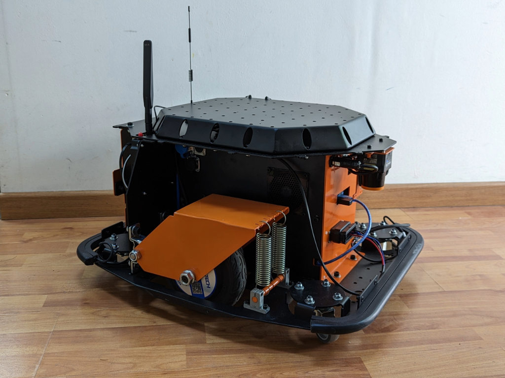
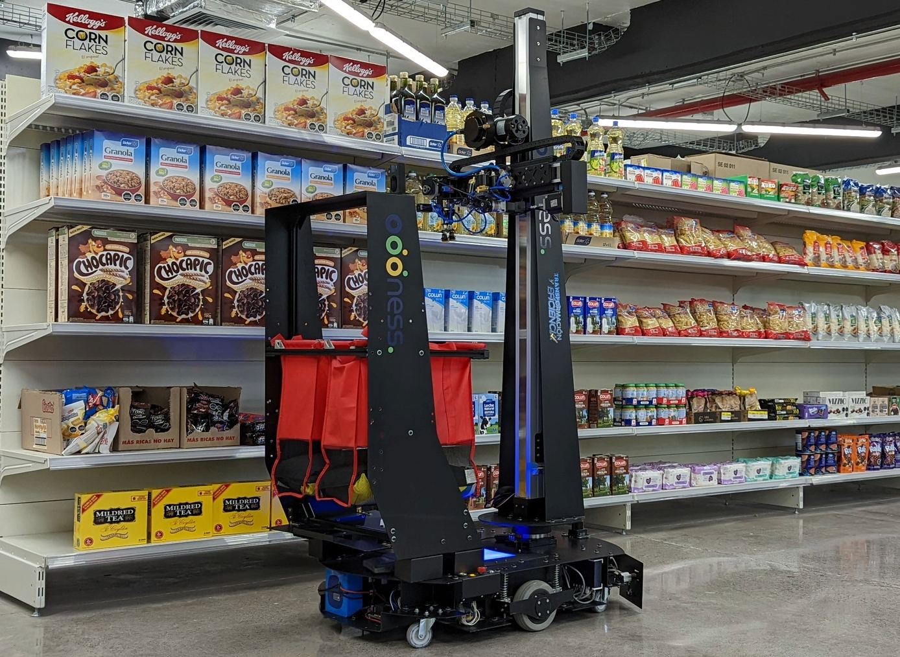
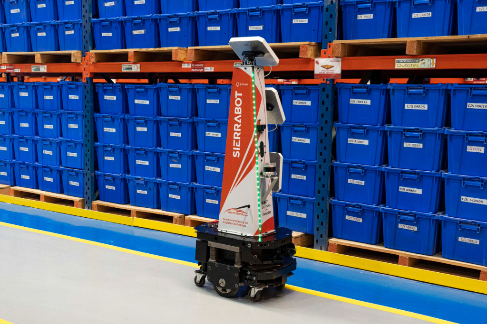

# About me

I'm a Robotics MS student at the University of Michigan. I have a background in Robotics and Electrical Engineering, and I am dedicated to creating innovative robotic solutions that can bridge the gap between academic research and real-world applications. I am currently working at ROAHM (Robotics and Optimization for the Analysis of Human Motion) Lab, advised by Professor Ram Vasudevan.

Contact me: [Email](mailto:jneyza@umich.edu) | [LinkedIn](https://www.linkedin.com/in/joseantonioe/) | [CV](https://drive.google.com/file/d/1Oj1l2WX7ytvlvAxrHItkPd76vWbxMbpK/view?usp=sharing)

# Portfolio

## Research

### [Tactile Neural De-rendering](https://www.mmintlab.com/research/tactile-neural-derendering/)

    
    

While working at the MMINT Lab at the University of Michigan, I submitted this work to ICRA 2025 (pending review). In it, we introduced Tactile Neural De-rendering, a novel approach that leverages a generative model to reconstruct a local 3D representation of an object based solely on its tactile signature. If you want to know more, click <a href="https://www.mmintlab.com/research/tactile-neural-derendering/">here</a> to go the project webpage.

## Class Projects at UMICH

### [ROB 550 Robotics Systems Laboratory](https://github.com/jneyzaguirre1/MBot_forklift)

    
    

This multidisciplinary laboratory class provides exposure to sensing, reasoning, and acting in physically-embodied systems. The class is divided into two labs over the semester: Armlab and Botlab, where students tackle common robotics challenges involving manipulators and mobile robots. One of the projects I am particularly proud of is the forklift design I did for one of the Botlab tasks. Using only one actuator, acrylic, and 3D printing, I was able to design a relatively small and fast forklift. If you want to see the files and a video, click <a href="https://github.com/jneyzaguirre1/MBot_forklift">here</a>.

### [ROB 599 Deep Learning for Robotic Perception](https://github.com/jneyzaguirre1/dino_evaluation)

    
    

Deep Leaning class focused on robotics perception. The final project for this class involved reviewing, evaluating, and improving a recent paper. In my case, we worked on "Emerging Properties in Self-Supervised Vision Transformers (DINO)". As a group we tried to improve the work done in this paper by using a weak supervision training strategy to help stabilize the framework's sensibility to hyperparamters. Click <a href="https://github.com/jneyzaguirre1/dino_evaluation">here</a> to go to the project repo.

## Work Projects

### Cumpa Mobile Robot

    
    

While working at the startup Oddness Technologies, I led the hardware development of a new indoor autonomous mobile robot for the company. The goal was to create a versatile mobile base to offer to our clients, capable of carrying loads, sensors, or anything that fits the customers' needs. I designed the electronics (PCB), mechanical structure, and firmware, and also conducted the initial tests of this robot.

### Picker Robot New Gripper

    
    

Oddness needed a new version of the picker robot's gripper, capable of grasping a wide variety of products types: boxes, bags, cans, bottles, etc. I worked with an industrial designer to create a prototype of this gripper. Our design had two fingers, suction cups, permanent magnets, and a horseshoe-like mount for two differen bottle cap sizes, making it a very versatile solution in a small form factor.

### Picker Robot

    
    

 When I started working at Oddness, my first project was to develop the first version of the picker-robot: an autonomous mobile robot (AMR) with a five degrees-of-freedom arm on top. It was a very challenging experience that had many design iterations, and testing at grocery stores.

### [RFID Sensor Tower for Warehouse Invetory Tracking](https://youtu.be/xM8xKJk1jqE?si=R4uxR6jV7XnJK5Au&t=24)

    
    

While working at Oddness Technologies, I was challenged to design a working prototype of an RFID sensor tower for a warehouse inventory tracking system in less than a month. Using mostly off-the-shelf components, sheet metal, and some creativity, I was able to design and manufacture the first working version of Sierrabot's sensor tower. Click <a href="https://youtu.be/xM8xKJk1jqE?si=R4uxR6jV7XnJK5Au&t=24">here</a> to watch a video.

