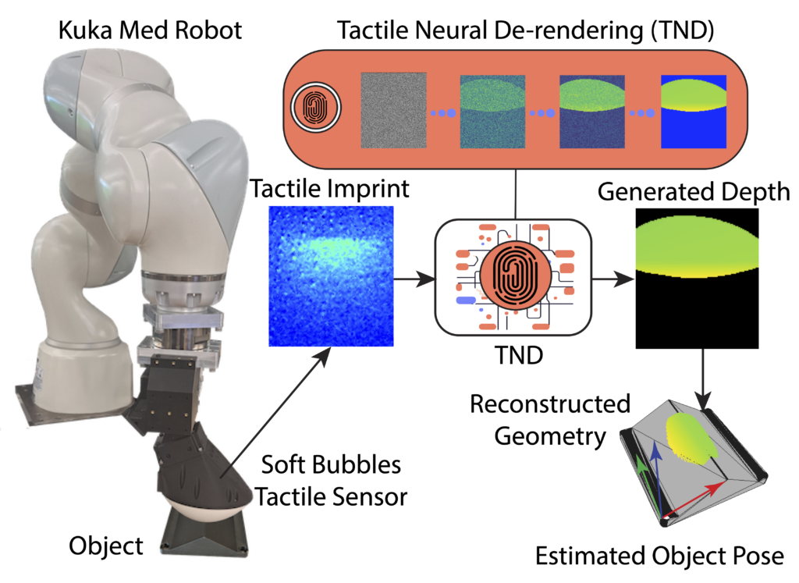
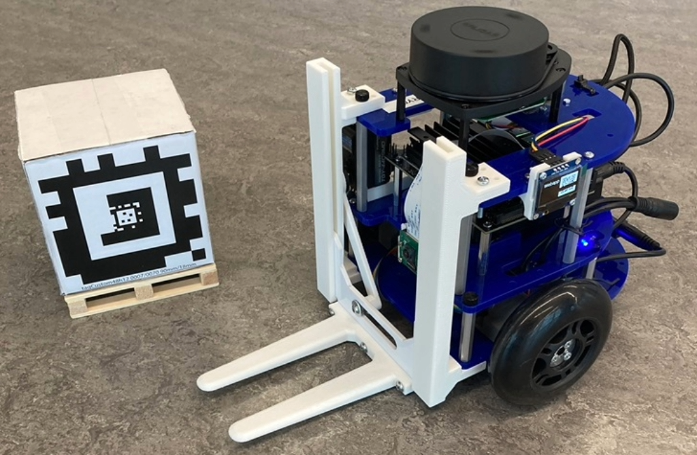
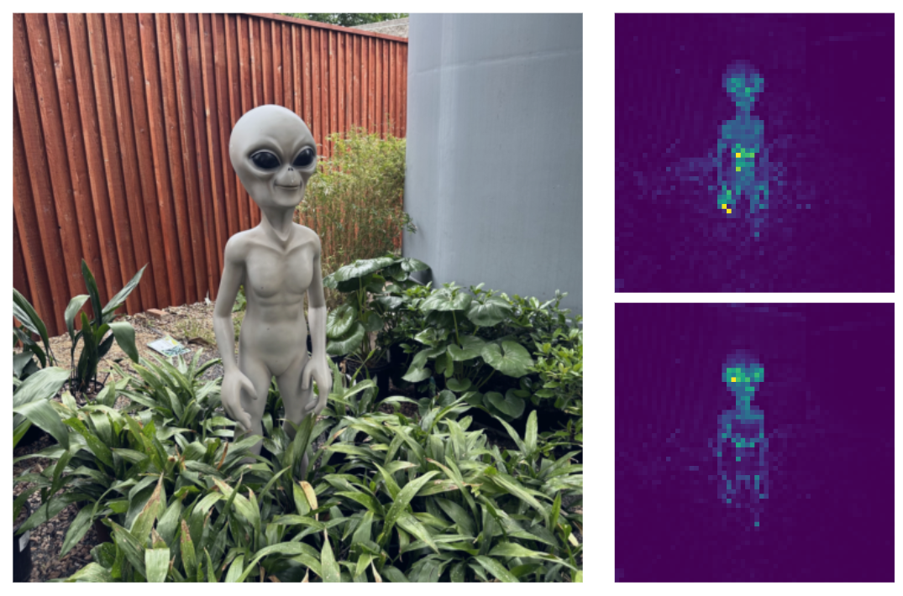
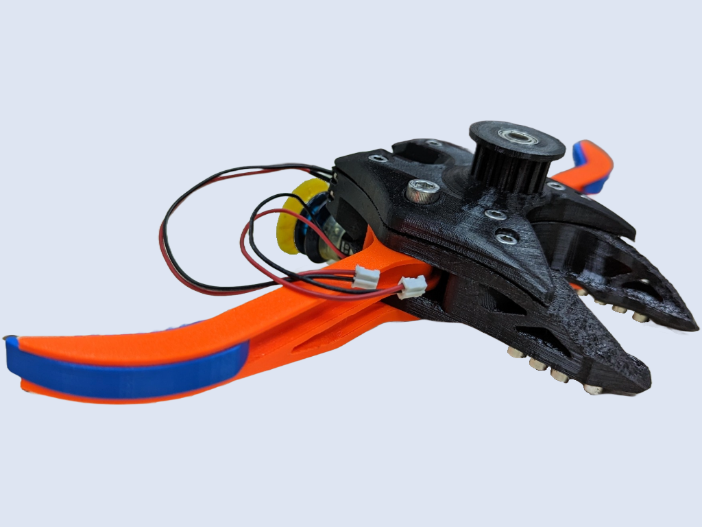

# About me

I'm a Robotics MS student at the University of Michigan. I have a background in Robotics and Electrical Engineering, and I am dedicated to creating innovative robotic solutions that can bridge the gap between academic research and real-world applications. I am currently working at ROAHM (Robotics and Optimization for the Analysis of Human Motion) Lab, advised by Professor Ram Vasudevan.

# Portfolio

## Research

### [Tactile Neural De-rendering](https://www.mmintlab.com/research/tactile-neural-derendering/)

    
    
Reconstructing local 3D representation of an object from its tactile signature by leveraging generative models.
    

## Class Projects at UMICH

### [ROB 550 Robotics Systems Laboratory](https://github.com/jneyzaguirre1/MBot_forklift)

    
    
Multidisciplinary laboratory class with exposures to sensing, reasoning, and acting for physically-embodied systems. The class is divided in two labs through the semester: Armlab and Botlab.
    

### [ROB 599 Deep Learning for Robotic Perception](https://github.com/jneyzaguirre1/dino_evaluation)

    
    
Deep Leaning class focused on robotics perception. This class final project consist on reviewing, checking, and improving a recent paper, in my case "Emerging Properties in Self-Supervised Vision Transformers (DINO)".
    

## Work Projects

### Picker Robot New Gripper

    
    
For our picker robot we needed a new version of the gripper capable of grasping a wide variety of products type: boxes, bags, cans, bottles, etc. So I worked with an industrial designer in a prototype of this gripper. Our design had two fingers, suction cups, permanent magnets, and a horseshoe like mount for two differen bottle cup sizes. 
    

### Cumpa Mobile Robot

### Picker Robot

### [RFID Sensor Tower for Warehouse Invetory Tracking](https://youtu.be/xM8xKJk1jqE?si=R4uxR6jV7XnJK5Au&t=24)

### 

